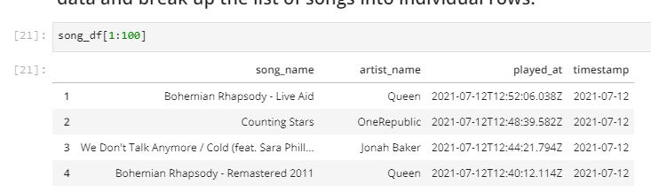

# Udacity-Capstone-Project

## Introduction

In this project we are creating a simple data pipeline, which fetches data from Spotify API and push it to a Database table. this single table procedure works once a day to fetch data for songs listened to in last 24 hours and append to a table in postgres database.

## Prerequisite

User Account on Spotify https://developer.spotify.com/ for getting OAuth Token

## ETL Process

### Extract:
Data is being extracted using an API provided by Spotify, API is accessible with User Token which can be generated from following source.

Source: https://api.spotify.com/v1/me/player/recently-played
example of API call using requests library requests.get("https://api.spotify.com/v1/me/player/recently-played?after={time}".format(time=yesterday_unix_timestamp), headers = headers)

### Dataframe

### Transform:
output of API call get stored in a JSON object. We are storing relevant data from json file to list and creating a dictionary. we are then converting dictionary to pandas dataframe.

### Data Validation
we have a procedure to perform few validation on imported data, which is being run before Loading data to tables.

### Data Load
Data Load being performed with a function which loads data stored in df to table.

### Airflow Pipeline

ETL process is set to be ran on daily basis for all the songs listened by an user in past 24 hours. DAG is created to perform

